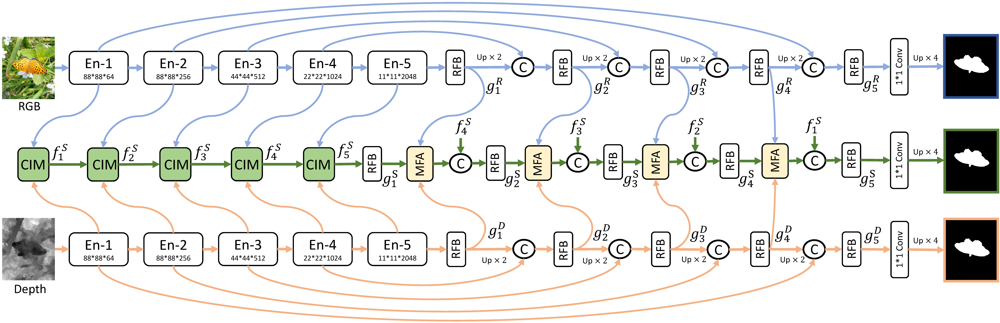
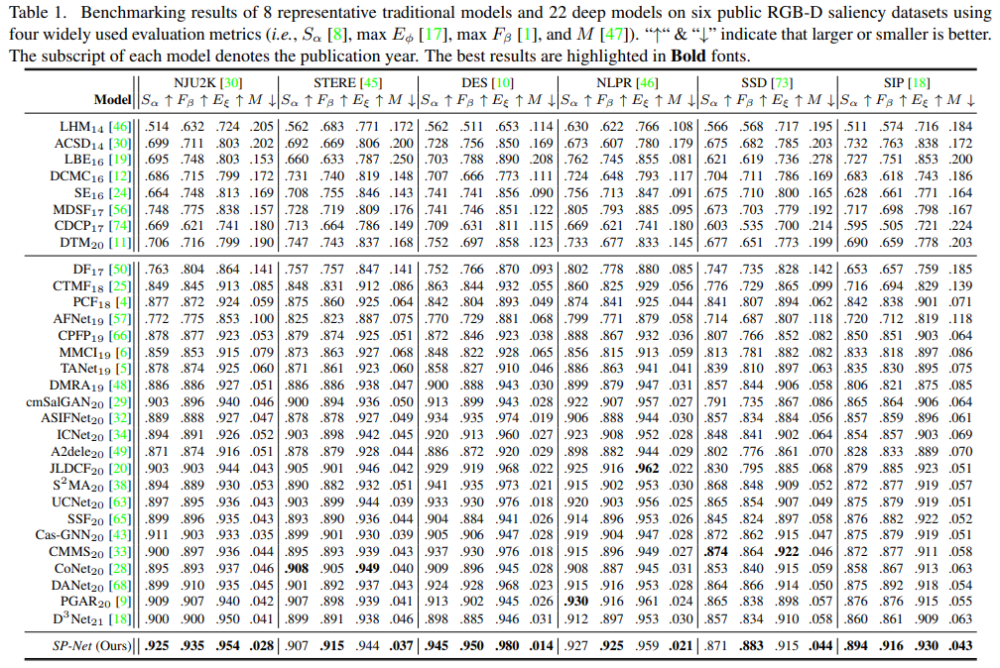

# Specificity-preserving RGB-D Saliency Detection

> **Authors:** 
> [*Tao Zhou*](https://taozh2017.github.io),
> [*Huazhu Fu*](https://hzfu.github.io/),
> [*Geng Chen*](https://scholar.google.com/citations?hl=en&user=sJGCnjsAAAAJ),
> [*Yi Zhou*](https://cse.seu.edu.cn/2021/0303/c23024a362239/page.htm),
> [*Deng-Ping Fan*](https://dpfan.net/),
> and [*Ling Shao*](https://scholar.google.com/citations?user=z84rLjoAAAAJ&hl=en).

## 1. Preface

- This repository provides code for "_**Specificity-preserving RGB-D Saliency Detection**_" ICCV-2021. 

## 2. Overview

### 2.1. Introduction

RGB-D saliency detection has attracted increasing attention, due to its effectiveness and the fact that depth cues can now be conveniently captured. Existing works often focus on learning a shared representation through various fusion strategies, with few methods explicitly considering how to preserve modality-specific characteristics. In this paper, taking a new perspective, we propose a specificitypreserving network (SP-Net) for RGB-D saliency detection, which benefits saliency detection performance by exploring both the shared information and modality-specific properties (e.g., specificity). Specifically, two modality-specific networks and a shared learning network are adopted to generate individual and shared saliency maps. A crossenhanced integration module (CIM) is proposed to fuse cross-modal features in the shared learning network, which are then propagated to the next layer for integrating cross-level information. Besides, we propose a multi-modal feature aggregation (MFA) module to integrate the modality-specific features from each individual decoder into the shared decoder, which can provide rich complementary multi-modal information to boost the saliency detection performance. Further, a skip connection is used to combine hierarchical features between the encoder and decoder layers. Experiments on six benchmark datasets demonstrate that our SP-Net outperforms other state-of-the-art methods. 

### 2.2. Framework Overview

      
    <em> 
    Figure 1: The overall architecture of the proposed SP-Net.
    </em>

### 2.3. Quantitative Results

      

### 2.4. Qualitative Results

      
    <em> 
    Figure 2: Visual comparisons of our method and eight state-of-the-art methods.
    </em>

## 3. Proposed Baseline

### 3.1. Training/Testing

The training and testing experiments are conducted using [PyTorch](https://github.com/pytorch/pytorch) with one NVIDIA Tesla V100 GPU with 32 GB memor.

1. Configuring your environment (Prerequisites):
    
    + Installing necessary packages: `pip install -r requirements.txt`.

1. Downloading necessary data:

    + Downloading training dataset ([download link (Google Drive)](https://drive.google.com/file/d/1Orss85k3wEUgDhItwT1goEN6WQFA1SOw/view?usp=sharing)) and move it into `./Data/`.

    + Downloading testing dataset ([download link (Google Drive)](https://drive.google.com/file/d/1sWJqCg2dAKSSkfrvB7zkwwsW6Ybd4Gd1/view?usp=sharing)) and move it into `./Data/`.

        
    + Downloading pretrained weights ([download link (Google Drive)](https://drive.google.com/file/d/13LuyVhSqbhxkE0dmRuy9QXbXOMBDSIcD/view?usp=sharing)) and move it into `./Checkpoint/SPNet/`.

    

1. Train Configuration:

    + After you download training dataset, just run `train.py` to train our model.
    

1. Test Configuration:

    + After you download all the pre-trained model and testing dataset, just run `test_produce_maps.py` to generate the final prediction map, then run `test_evaluation_maps.py` to obtain the final quantitative results. 
    
    + You can also download predicted saliency maps ([download link (Google Drive)](https://drive.google.com/file/d/1-3N8hNgDNki-NTp1UbbFGDKUwjIv3QFo/view?usp=sharing)) and move it into `./Predict_maps/`, then then run `test_evaluation_maps.py`.
    
    
### 3.2 Evaluating your trained model:

Our evaluation is implemented by python, please refer to `test_evaluation_maps.py`

## 4. Citation

Please cite our paper if you find the work useful, thanks!

	@inproceedings{zhouiccv2021,
  		title={Specificity-preserving RGB-D Saliency Detection},
  		author={Zhou, Tao and Fu, Huazhu and Chen, Geng and Zhou, Yi and Fan, Deng-Ping and Shao, Ling},
  		booktitle={International Conference on Computer Vision (ICCV)},
  		year={2021},
	}
	
	@inproceedings{zhoucvmj2022,
  		title={Specificity-preserving RGB-D Saliency Detection},
  		author={Zhou, Tao and Fan, Deng-Ping and Chen, Geng and Zhou, Yi and Fu, Huazhu},
  		booktitle={Computational Visual Media},
  		year={2022},
	}

**[⬆ back to top](#0-preface)**
